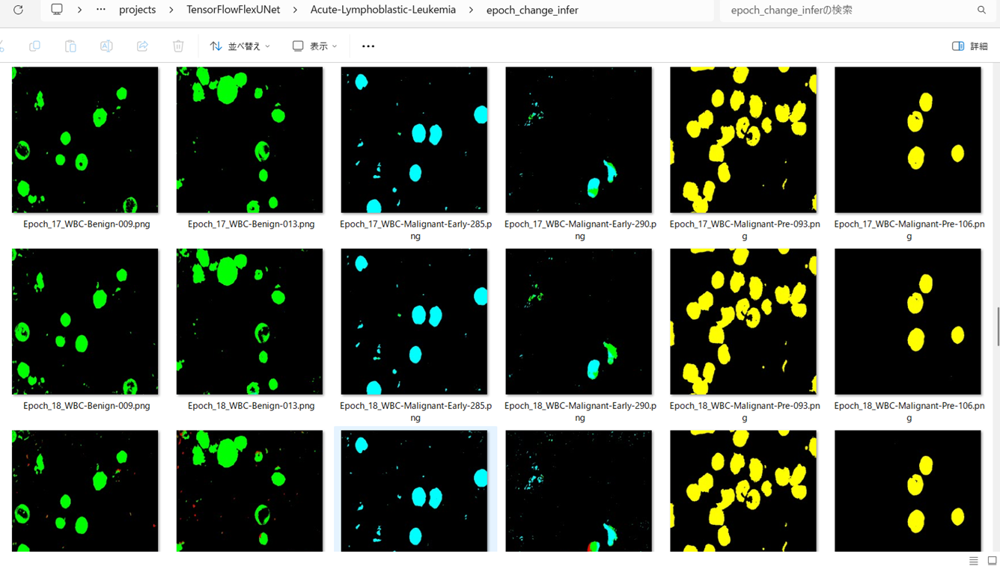

<h2>TensorFlow-FlexUNet-Image-Segmentation-Acute-Lymphoblastic-Leukemia (2025/07/24)</h2>

This is the first experiment of Image Segmentation for Acute-Lymphoblastic-Leukemia based on our TensorFlowFlexUNet (TensorFlow Flexible UNet Image Segmentation Model for Multiclass) 
and a 512x512 pixels 
<a href="https://drive.google.com/file/d/1jqi4j9ntD9wgIhTxSRS9WK9WwudLCocA/view?usp=sharing">
Acute-Lymphoblastic-Leukemia-ImageMask-Dataset.zip</a>.
which was derived by us from  
<a href="https://www.kaggle.com/datasets/mehradaria/leukemia">Acute Lymphoblastic Leukemia (ALL) image dataset
</a>
 
 
<b>Acutual Image Segmentation for 512x512 Acute-Lymphoblastic-Leukemia images</b> 
As shown below, the inferred masks look similar to the ground truth masks. 
The green region represents a benign, the cyan a malignant-early, and the yellow a malignant-pre respectively.  
<table>
<tr>
<th>Input: image</th>
<th>Mask (ground_truth)</th>
<th>Prediction: inferred_mask</th>
</tr>
<tr>
<td></td>
<td></td>
<td></td>
</tr>
<tr>
<td></td>
<td></td>
<td></td>
</tr>
<tr>
<td></td>
<td></td>
<td></td>
</tr>
</table>

 
<h3>1. Dataset Citation</h3>

The image dataset used here has been taken from the following kaggle web site.
<a href="https://www.kaggle.com/datasets/mehradaria/leukemia">Acute Lymphoblastic Leukemia (ALL) image dataset
</a> 

If you use this dataset in your research, please credit the authors.  

<b>Data Citation:</b>  
Mehrad Aria, Mustafa Ghaderzadeh, Davood Bashash, Hassan Abolghasemi, Farkhondeh Asadi, and Azamossadat Hosseini, 
“Acute Lymphoblastic Leukemia (ALL) image dataset.” Kaggle, (2021). 
 DOI: 10.34740/KAGGLE/DSV/2175623. 
 
<b>Publication Citation:</b>  
Ghaderzadeh, M, Aria, M, Hosseini, A, Asadi, F, Bashash, D, Abolghasemi, H.  
A fast and efficient CNN model for B-ALL diagnosis and its subtypes classification  
using peripheral blood smear images. 
 Int J Intell Syst. 2022; 37: 5113- 5133. doi:10.1002/int.22753 
 

<h3>
<a id="2">
2 Acute-Lymphoblastic-Leukemia ImageMask Dataset
</a>
</h3>
 If you would like to train this Acute-Lymphoblastic-Leukemia Segmentation model by yourself,
 please download the dataset from the google drive  
<a href="https://drive.google.com/file/d/1jqi4j9ntD9wgIhTxSRS9WK9WwudLCocA/view?usp=sharing">
Acute-Lymphoblastic-Leukemia-ImageMask-Dataset.zip</a>.
 
, expand the downloaded ImageMaskDataset and put it under <b>./dataset</b> folder to be
<pre>
./dataset
└─Acute-Lymphoblastic-Leukemia
    ├─test
    │   ├─images
    │   └─masks
    ├─train
    │   ├─images
    │   └─masks
    └─valid
        ├─images
        └─masks
</pre>
 
<b>Acute-Lymphoblastic-Leukemia Statistics</b> 
 
 
<!--
On the derivation of the dataset, please refer to the following Python scripts: 
<li><a href="./generator/ImageMaskDatasetGenerator.py">ImageMaskDatasetGenerator.py</a></li>
<li><a href="./generator/split_master.py">split_master.py</a></li>
 
-->
As shown above, the number of images of train and valid datasets is not so large to use for a training set of our segmentation model.
 
 
<b>Train_images_sample</b> 

 
<b>Train_masks_sample</b> 

 
<h3>
3 Train TensorFlowFlexUNet Model
</h3>
 We trained Acute-Lymphoblastic-Leukemia TensorFlowFlexUNet Model by using the following
<a href="./projects/TensorFlowFlexUNet/Acute-Lymphoblastic-Leukemia/train_eval_infer.config"> <b>train_eval_infer.config</b></a> file.  
Please move to ./projects/TensorFlowFlexUNet/Acute-Lymphoblastic-Leukemia and run the following bat file. 
<pre>
>1.train.bat
</pre>
, which simply runs the following command. 
<pre>
>python ../../../src/TensorFlowFlexUNetTrainer.py ./train_eval_infer.config
</pre>

<b>Model parameters</b> 
Defined a small <b>base_filters = 16 </b> and large <b>base_kernels = (9,9)</b> for the first Conv Layer of Encoder Block of 
<a href="./src/TensorFlowFlexUNet.py">TensorFlowFlexUNet.py</a> 
and a large num_layers (including a bridge between Encoder and Decoder Blocks).
<pre>
[model]
;You may specify your own UNet class derived from our TensorFlowFlexModel
model         = "TensorFlowFlexUNet"
generator     =  False
image_width    = 512
image_height   = 512
image_channels = 3
num_classes    = 5

base_filters   = 16
base_kernels   = (9,9)
num_layers     = 8
dropout_rate   = 0.04
dilation       = (1,1)
</pre>
<b>Learning rate</b> 
Defined a very small learning rate.  
<pre>
[model]
learning_rate  = 0.00005
</pre>
<b>Loss and metrics functions</b> 
Specified "categorical_crossentropy" and <a href="./src/dice_coef_multiclass.py">"dice_coef_multiclass"</a>. 
<pre>
[model]
loss           = "categorical_crossentropy"
metrics        = ["dice_coef_multiclass"]
</pre>
<b>Dataset class</b> 
Specifed <a href="./src/ImageCategorizedMaskDataset.py">ImageCategorizedMaskDataset</a> class. 
<pre>
[dataset]
class_name    = "ImageCategorizedMaskDataset"
</pre>
 
<b>Learning rate reducer callback</b> 
Enabled learing_rate_reducer callback, and a small reducer_patience.
<pre> 
[train]
learning_rate_reducer = True
reducer_factor     = 0.5
reducer_patience   = 4
</pre>
<b>Early stopping callback</b> 
Enabled early stopping callback with patience parameter.
<pre>
[train]
patience      = 10
</pre>

<b>RGB Color map</b> 
rgb color map dict for Acute-Lymphoblastic-Leukemia 1+4 classes. 
<pre>
[mask]
mask_file_format = ".png"
; 1+4 classes
;categories = ["Benign", "Early", "Pre", "Pro"]
; RGB colors        Benign:green, Early:cyan,    Pre:yello,      Pro:red
rgb_map = {(0,0,0):0,(0,255,0):1,(0,255,255):2, (255, 255, 0):3, (255, 0,0):4}
</pre>

<b>Epoch change inference callback</b> 
Enabled <a href="./src/EpochChangeInfereuncer.py">epoch_change_infer callback</a></b>. 
<pre>
[train]
epoch_change_infer       = True
epoch_change_infer_dir   =  "./epoch_change_infer"
num_infer_images         = 6
</pre>

By using this callback, on every epoch_change, the inference procedure can be called
 for 6 images in <b>mini_test</b> folder. This will help you confirm how the predicted mask changes 
 at each epoch during your training process.    

<b>Epoch_change_inference output at starting (epoch 1,2,3)</b> 
 
 
<b>Epoch_change_inference output at middlepoint (epoch 21,22,23)</b> 
 
 
<b>Epoch_change_inference output at ending (epoch 44,45,46)</b> 
 
 
In this experiment, the training process was stopped at epoch 46 by EarlyStopping callback.  
 
 

<a href="./projects/TensorFlowFlexUNet/Acute-Lymphoblastic-Leukemia/eval/train_metrics.csv">train_metrics.csv</a> 
 

 
<a href="./projects/TensorFlowFlexUNet/Acute-Lymphoblastic-Leukemia/eval/train_losses.csv">train_losses.csv</a> 
 

 

<h3>
4 Evaluation
</h3>
Please move to <b>./projects/TensorFlowFlexUNet/Acute-Lymphoblastic-Leukemia</b> folder, 
and run the following bat file to evaluate TensorFlowFlexUNet model for Acute-Lymphoblastic-Leukemia. 
<pre>
./2.evaluate.bat
</pre>
This bat file simply runs the following command.
<pre>
python ../../../src/TensorFlowFlexUNetEvaluator.py ./train_eval_infer_aug.config
</pre>

Evaluation console output: 

  

<a href="./projects/TensorFlowFlexUNet/Acute-Lymphoblastic-Leukemia/evaluation.csv">evaluation.csv</a> 
The loss (categorical_crossentropy) to this Acute-Lymphoblastic-Leukemia/test was not low and dice_coef_multiclass 
high as shown below.
 
<pre>
categorical_crossentropy,0.0285
dice_coef_multiclass,0.9835
</pre>
 

<h3>
5 Inference
</h3>
Please move <b>./projects/TensorFlowFlexUNet/Acute-Lymphoblastic-Leukemia</b> folder 
,and run the following bat file to infer segmentation regions for images by the Trained-TensorFlowFlexUNet model for Acute-Lymphoblastic-Leukemia. 
<pre>
./3.infer.bat
</pre>
This simply runs the following command.
<pre>
python ../../../src/TensorFlowFlexUNetInferencer.py ./train_eval_infer_aug.config
</pre>

<b>mini_test_images</b> 
 
<b>mini_test_mask(ground_truth)</b> 
 

<b>Inferred test masks</b> 
 
 

<b>Enlarged images and masks of 512x512 pixels</b> 

<table>
<tr>
<th>Image</th>
<th>Mask (ground_truth)</th>
<th>Inferred-mask</th>
</tr>

<tr>
<td></td>
<td></td>
<td></td>
</tr>

<tr>
<td></td>
<td></td>
<td></td>
</tr>

<tr>
<td></td>
<td></td>
<td></td>
</tr>

<tr>
<td></td>
<td></td>
<td></td>
</tr>

<tr>
<td></td>
<td></td>
<td></td>
</tr>

<tr>
<td></td>
<td></td>
<td></td>
</tr>
</table>

 
<h3>
References
</h3>
<b>1. Acute Lymphoblastic Leukemia (ALL) image dataset. Kaggle, (2021)</b> 
Mehrad Aria, Mustafa Ghaderzadeh, Davood Bashash, Hassan Abolghasemi, Farkhondeh Asadi, and Azamossadat Hosseini, 

 DOI: 10.34740/KAGGLE/DSV/2175623. 
 

<b>2. A fast and efficient CNN model for B-ALL diagnosis and its subtypes classification using peripheral blood smear images</b>
  
Ghaderzadeh, M, Aria, M, Hosseini, A, Asadi, F, Bashash, D, Abolghasemi, H.  
<a href="https://onlinelibrary.wiley.com/doi/full/10.1002/int.22753">https://onlinelibrary.wiley.com/doi/full/10.1002/int.22753</a>
 
 
<b>3. Tensorflow-Image-Segmentation-Early-Acute-Lymphoblastic-Leukemia/b>
  
Toshiyuki Arai @antillia.com 
<a href="https://github.com/sarah-antillia/Tensorflow-Image-Segmentation-Early-Acute-Lymphoblastic-Leukemia-">
https://github.com/sarah-antillia/Tensorflow-Image-Segmentation-Early-Acute-Lymphoblastic-Leukemia-
</a>

